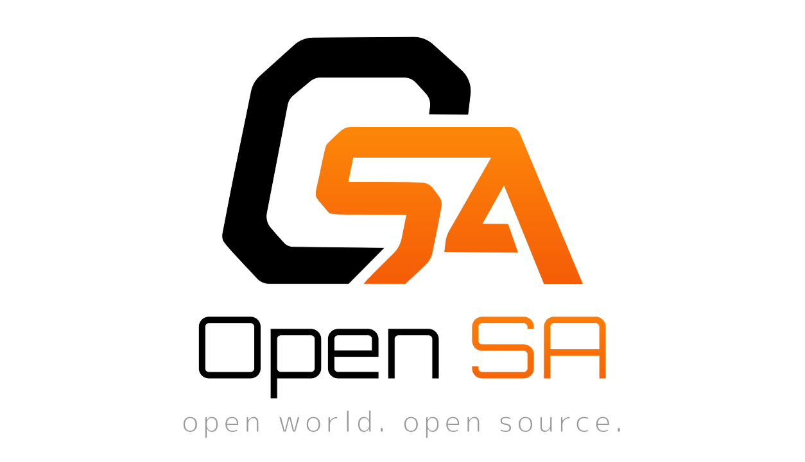

  

  
  

An open-source, from-scratch re-creation of the RenderWare engine — streaming the real San Andreas world, models and
physics, in the browser.

> Unofficial, non-commercial fan project. Not affiliated with Rockstar Games or Take-Two.

  

## Blog

Dev notes and progress - in [`/blog`](./blog).

- 2026-06-18 - [I built GTA San Andreas in the browser in three weeks - solo, with Claude Code](./2026-06-18-i-built-gta-san-andreas-in-the-browser-in-three-weeks-solo-with-claude-code.md)

## What's inside

A TypeScript / three.js renderer for GTA San Andreas assets (RenderWare DFF/TXD, COL collision, IMG
archives, IPL/IDE world streaming) with a Rapier-physics player and vehicles. See the
[architecture overview](./docs/architecture.md) and the per-feature reference in [docs/features/](./docs/features/).

## Contributing

Contributions are welcome - see **[CONTRIBUTING.md](./CONTRIBUTING.md)** for setup, the dev workflow, and
conventions. First-time asset setup: [docs/development/getting-started.md](./docs/development/getting-started.md).

# License

**CC BY-NC 4.0**

Commercial Use Restriction

This project is provided for personal, educational,
research, and non-commercial use only.

Commercial use, including but not limited to:

- selling copies,
- paid hosting,
- SaaS offerings,
- commercial redistribution,
- bundling into commercial products,

is prohibited without explicit written permission
from the copyright holder.

[LICENSE](./LICENSE)
