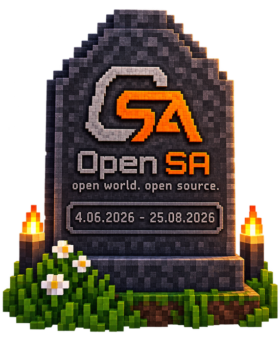

  

# OpenSA

**This project is closed.** OpenSA was an open-source game engine, written from scratch in TypeScript, built
compatible with RenderWare (the engine behind GTA San Andreas) and running in the browser. It lived from
4 June 2026 to 25 August 2026. The source code and the demo are no longer available.

The full story - why it was closed, what was built, and what comes next - is in the blog:

**[AlexSergey/my-blog](https://github.com/AlexSergey/my-blog)**

- [OpenSA is closed. The rise of AI, and thoughts on how to survive in the age of AI](https://github.com/AlexSergey/my-blog/blob/main/opensa/4-opensa-is-closed-the-rise-of-ai-and-how-to-survive-in-the-age-of-ai.md)
- [An AAA engine for GTA San Andreas in the browser - and rewriting Three.js](https://github.com/AlexSergey/my-blog/blob/main/opensa/3-an-aaa-engine-for-gta-san-andreas-in-the-browser-and-rewriting-threejs.md)
- [How I built a perfect GTA San Andreas map with my own engine](https://github.com/AlexSergey/my-blog/blob/main/opensa/2-how-i-built-a-perfect-gta-san-andreas-map-with-my-own-engine.md)
- [I ran GTA San Andreas on my own engine in the browser - solo with Claude, in 3 weeks](https://github.com/AlexSergey/my-blog/blob/main/opensa/1-i-ran-gta-san-andreas-on-my-own-engine-in-the-browser-solo-with-claude-in-3-weeks.md)

> OpenSA was an unofficial, non-commercial fan project, not affiliated with Rockstar Games or Take-Two Interactive.
> It never contained or distributed any game assets. GTA San Andreas, its assets and trademarks belong to
> Rockstar Games / Take-Two.
