# I built GTA San Andreas in the browser in three weeks — solo, with Claude Code

## Intro

If you can't be bothered to read — here are the important links right away:

- [Demo](https://opensa.cc)
- [Repo](https://github.com/AlexSergey/opensa)

And below is the detailed story of how I made a GTA San Andreas clone that runs in the browser.

---

For me, the GTA series isn't just games — it's my start in IT: these games are exactly what pulled me into programming and 3D graphics. And, let's be honest, apart from the first part I never actually finished a single one — so this is more about development than playing.

Back when I was still a student, in the distant 2000s, I made modifications for GTA Vice City and later San Andreas. I worked with the map, made models, wrote simple scripts. This hobby went on for several years, during which I got pretty familiar with the quirks of the RenderWare engine. But life moved on, I graduated, started working, forgot about GTA, and only followed the modelers' community — just to know who was doing what.

Many years later, in 2023, I decided to install San Andreas again. I joined the community Discords and was pleasantly surprised — GTA modding is alive and evolving. By that point I already had around 15 years in professional development, though I worked mostly on the WEB platform. In the evenings, purely as a hobby, I started poking at GTA again. I wrote little scripts in a language I barely understood, built Node.js wrappers around them — basically had fun however I could.

But all of it worked unstably. Debugging was hard. Anything could break at any moment. No regression testing. No tests. In short, kind of a mess.

And one thought kept spinning in my head — man, if only this were on the Web, on my home turf, I could really dig into it properly.

And then AI arrived. Gradually learning new AI-assisted development approaches, I rewrote a number of my projects, solved a range of problems of varying difficulty. And 3 weeks ago I thought: what if…

## The Beginning, MVP

RenderWare is a fairly old and simple engine. It has a few fundamental things that make it lightweight and powerful at the same time — its handling of models and textures. The DFF model format in GTA San Andreas supports a lot of functionality: from geometry data and levels of detail to day/night display variants (prelit, night vertex colors). And the TXD texture archive stores the textures themselves — bitmaps, alpha channels, and mip levels (texture detail at a distance).

It's a whole large specification that's very hard to cover even with mature 3ds Max plugins. There were many attempts to write a custom loader for three.js to load model data into the browser directly, without preprocessing — but those were mostly dead projects.

That was my starting point. My MVP. If I could load a simple DFF and TXD into the browser while preserving all the features — then I'd know what to do from there.

Armed with a Max subscription to Claude Code, I first created a simple React + three.js project that worked with an ordinary 3D model. I fed Opus links to open-source solutions for opening DFF/TXD, the spec, and some verbal notes, and within 5 minutes I had the same project, but already working with DFF/TXD. Sure, spec coverage was maybe 15% at that point, but the foundation was laid.

Next, the map — I already had an IDE/IPL file parser, plus a walker that can traverse the coordinates and assemble the map.

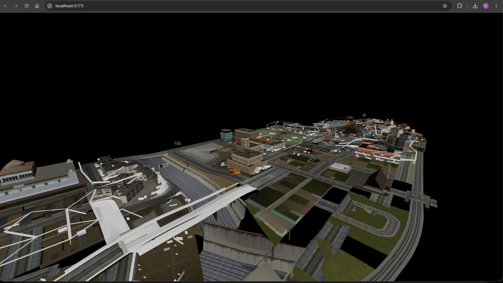

After a few fixes — dropping the low-poly objects meant for distant rendering and fixing the quaternions (that's the object's rotation relative to the map) — I got something resembling an actually assembled map.

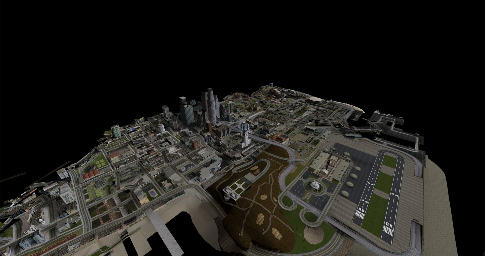
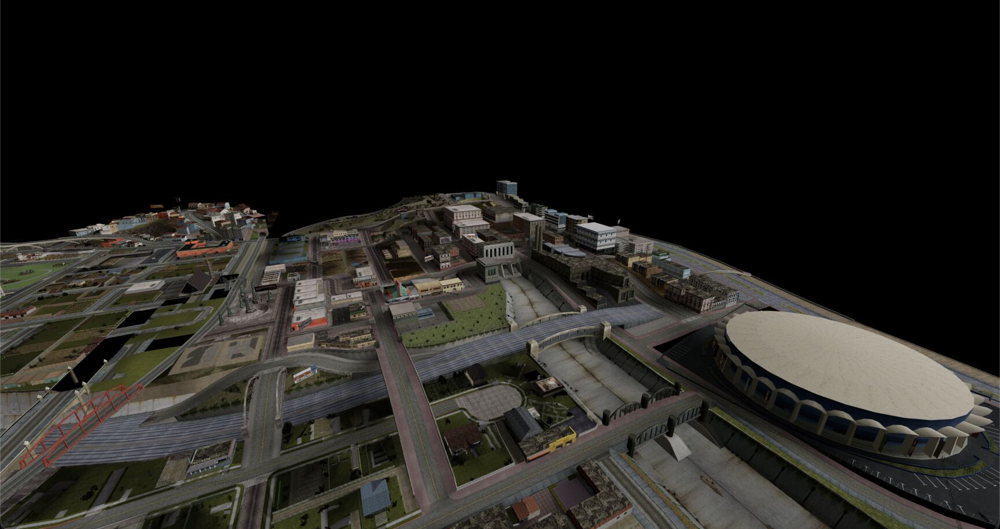

Unfortunately, there were still issues with some buildings and surfaces missing from the map, but it was huge progress!

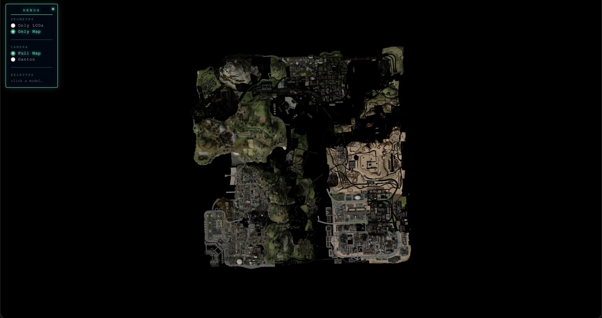

The MVP was ready. This stage showed me that it was all feasible in principle and that I'd be able to reproduce the game in the browser.

## Debugger

Before starting any complex project, I always think about one thing: how am I going to debug it?

For debugging OpenSA I used several layers:

**Logger.** Obviously, no project gets by without a good logger that can manage log levels.

**In-Game debugger.** Eventually this turned into a project within a project. A big editor that lets you control everything imaginable in real time: quickly teleport to a location, spawn vehicles, tweak weather and graphics. And most importantly — in this debugger we can enter map mode and instantly start hovering over the zone where the player is, toggle other zones, inspect which object is where, and so on. A full-blown map editor. The debugger keeps growing with new features.

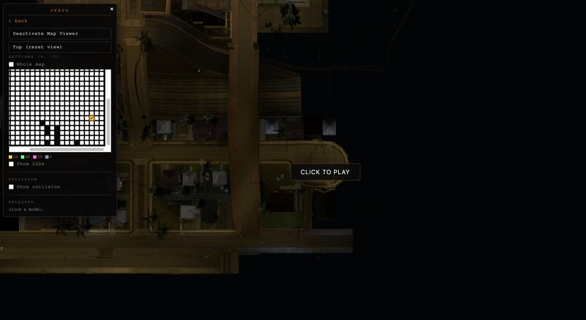
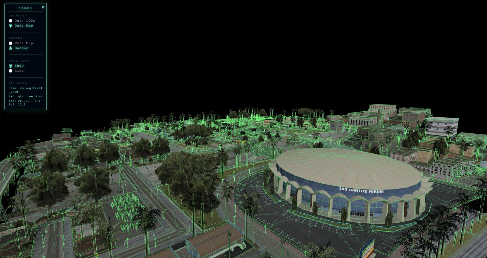

**Viewers.** Each object type has its own viewer — a separately built app whose job is to visualize an object and offer a few minimal actions. For example, playing an animation on a character:

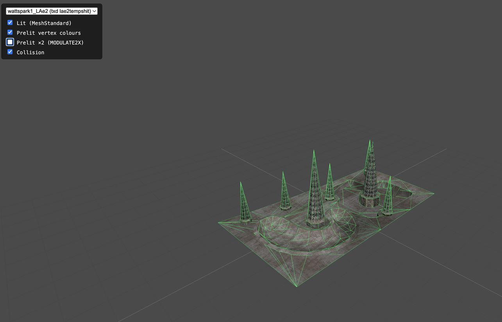
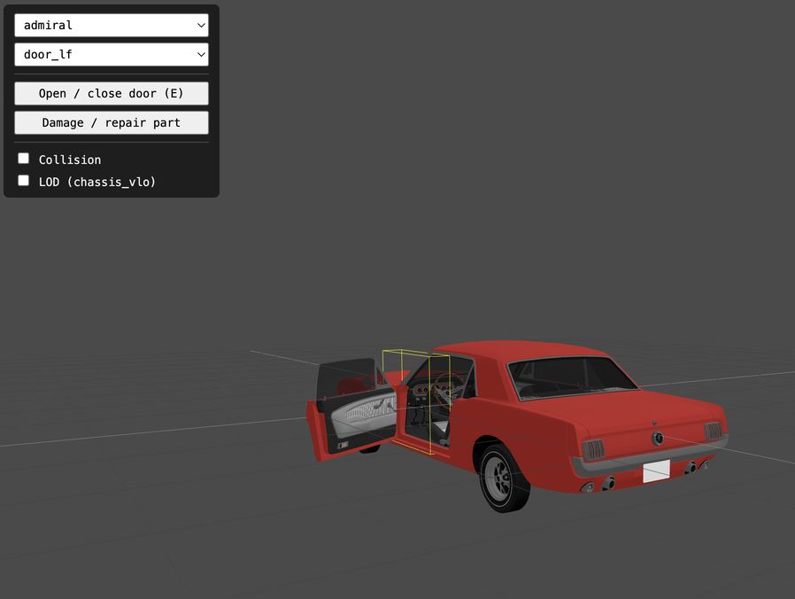
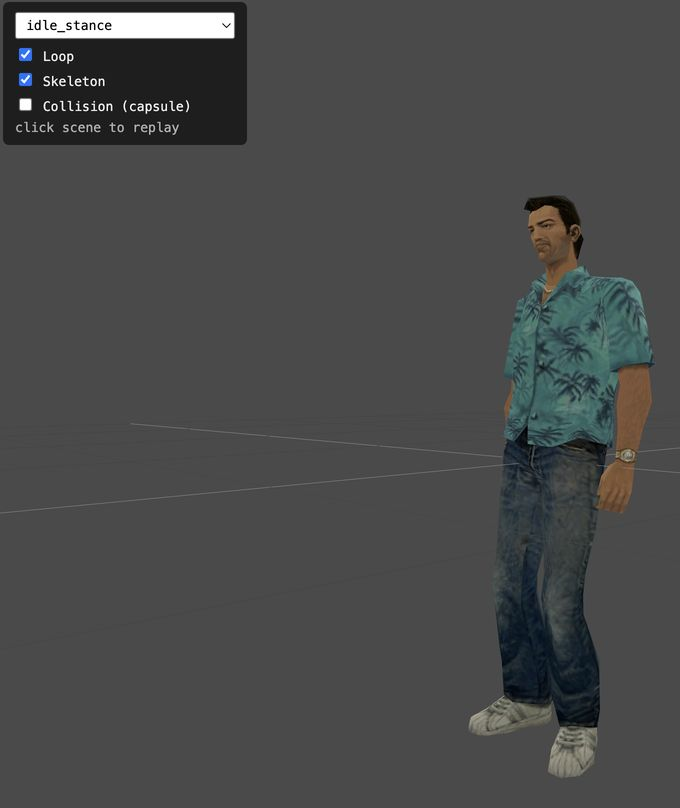

Also, smaller stuff: there are debug scripts and the core's own event system, but more on that later, when we talk about the architecture.

## First Problems

So, as I mentioned, after building good debugging tooling I started looking into the map problems — specifically, why so many structures were missing. It turned out the objects had no obvious, convenient-for-me marker indicating whether something is a map object or an interior. You could tell by indirect cues: most actual map objects have flags greater than 256, while anything lower is more likely an interior — though map elements showed up in there too.

So I came up with an indirect check — I wrote a script that examines all the map objects: if the value is below 256, it analyzes all the other objects with the same flag, and if their names contain road, land, and so on, then that flag's number qualifies as definitely belonging to the map.

And, oddly enough, this was the fastest and most accurate way to solve the problem. After that the whole map was ready.

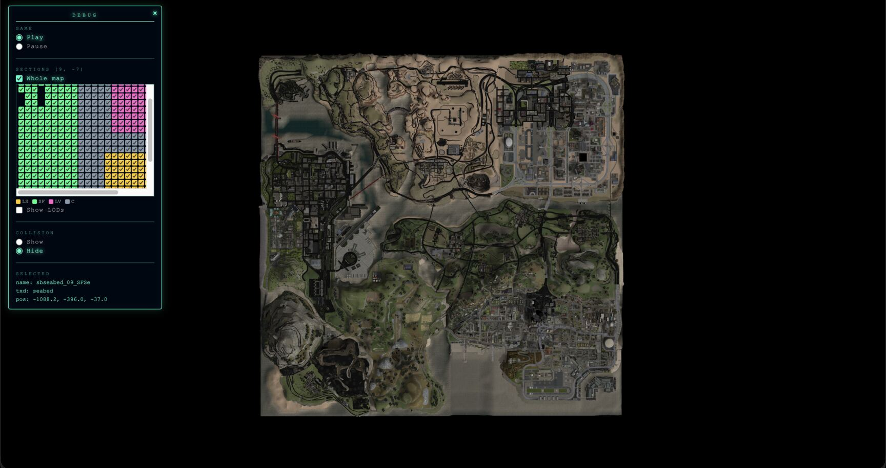

## Architecture

Having a complete map and confidence in the project, I started sketching the architecture. I'd designed complex multi-layered frontend systems before. In a project like this, the most important thing is to separate the UI, Game, and Engine logic.

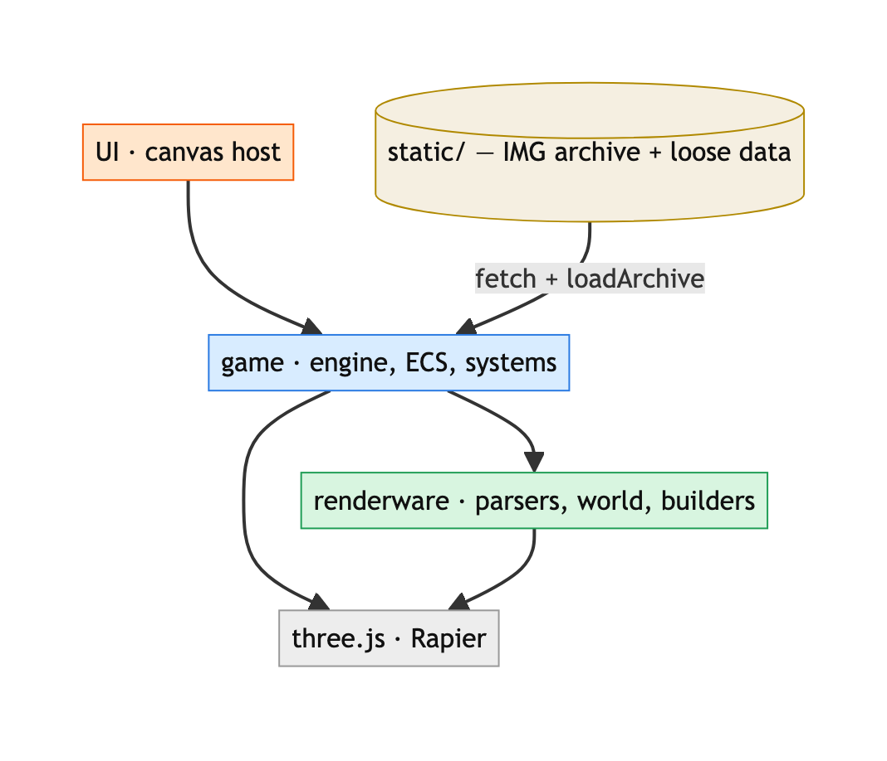

This gave us a fully independent system:

- **UI** is written in React, but we could use anything.
- **Game** is essentially a framework — a set of public methods that configure and drive the game. Initially Game worked directly with the game's file system (more on that later).
- **RenderWare** — all the parsers needed for GTA San Andreas; they connect to the game through an adapter. So by implementing and swapping the adapter for GTA Vice City, we can render Vice City too — and even more: if we mix adapters, we could in theory use, say, GTA San Andreas cars and characters but in the city of Vice City, or vice versa.
- Below that is the library layer — three.js, Rapier.

Since from the start I wanted to fully reproduce the engine, I had to work with the existing file system and existing formats. Parsers were implemented for every kind of file.

In the end I got an engine capable of opening not only the original game but, for example, mods for it too. More on that below.

The architecture will keep changing along the way.

## Characters

The original GTA San Andreas uses a modular system for the main character — it lets you change clothes, the player's style, and so on. For the test version I decided to limit myself to an ordinary skinned character model — like all the game's pedestrians. For recognizability, I took a converted Tommy Vercetti model from GTA Vice City.

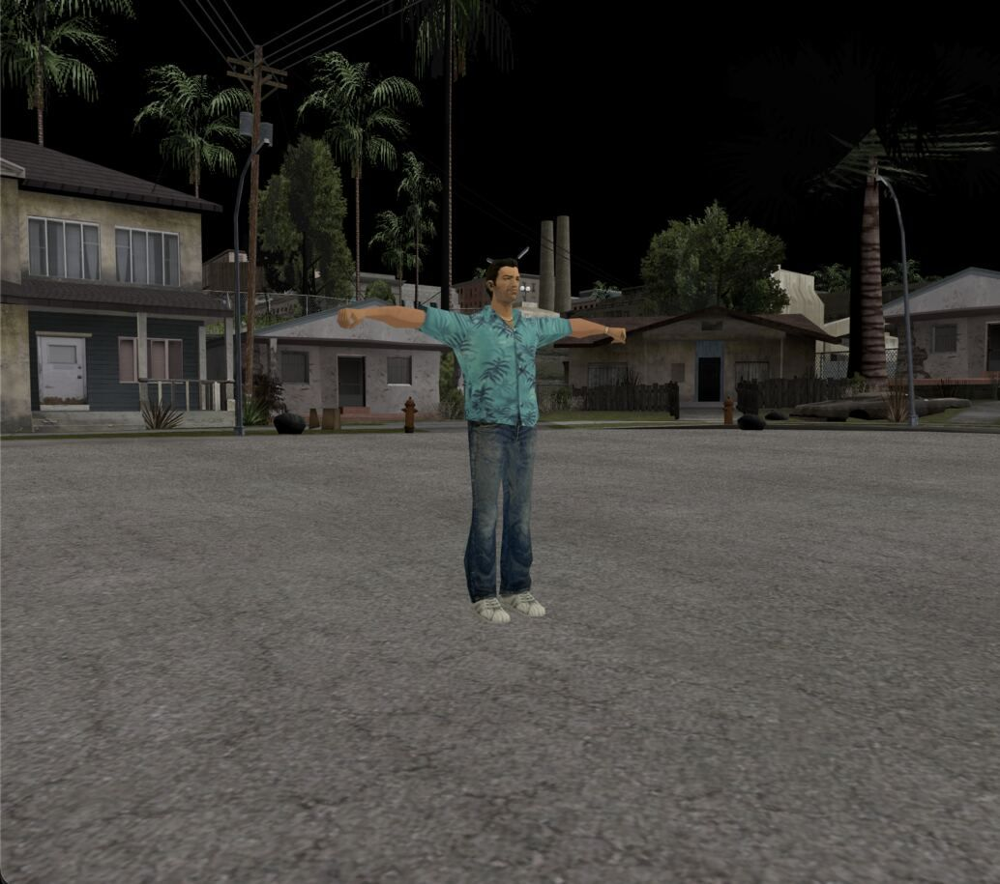

The funniest part of working on any game is dealing with character animations. The things I saw over the whole development period…

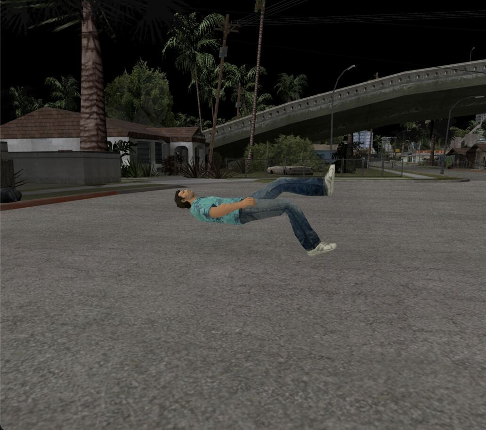
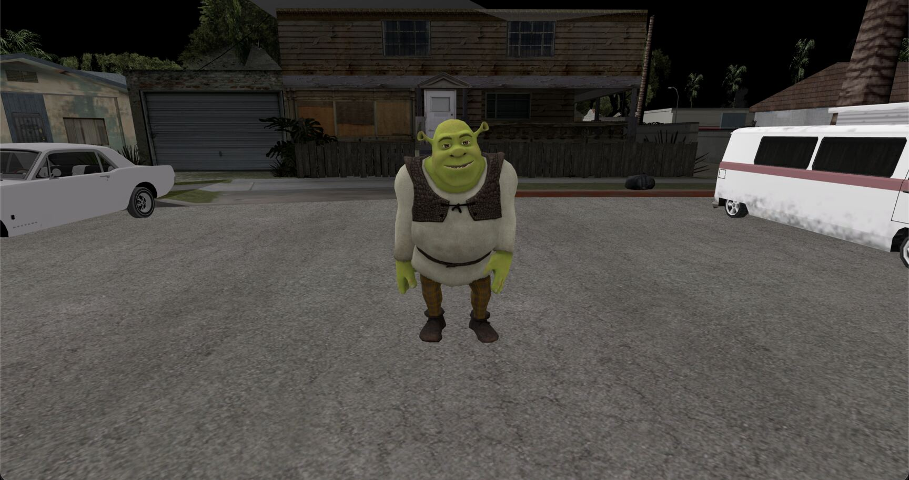
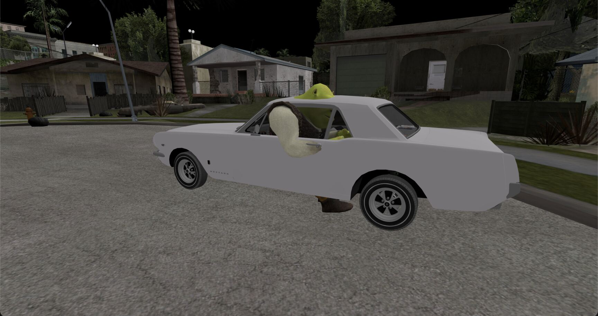

Once the animation manager was done, it was time for physics. At first I used a cube as the character's collision while moving, and he'd get stuck on every step. Then I learned it's better to use a capsule — that way the legs don't catch on curbs and the body doesn't get stuck in fences, since it's all rounded and smooth. Essentially, instead of Tommy, a pill like this walks around the map:

## Vehicles

I didn't have much trouble with the stock cars. I converted quite a few vehicles back in my student years and remembered the nuances well. But I wanted more — the GTA community has tons of high-quality custom models. I want to support them all! Well, almost all. So after installing a bunch of models from third-party authors, I was, to put it mildly, surprised by the number of bugs. I fixed most of them, but a few remain as future fixes.

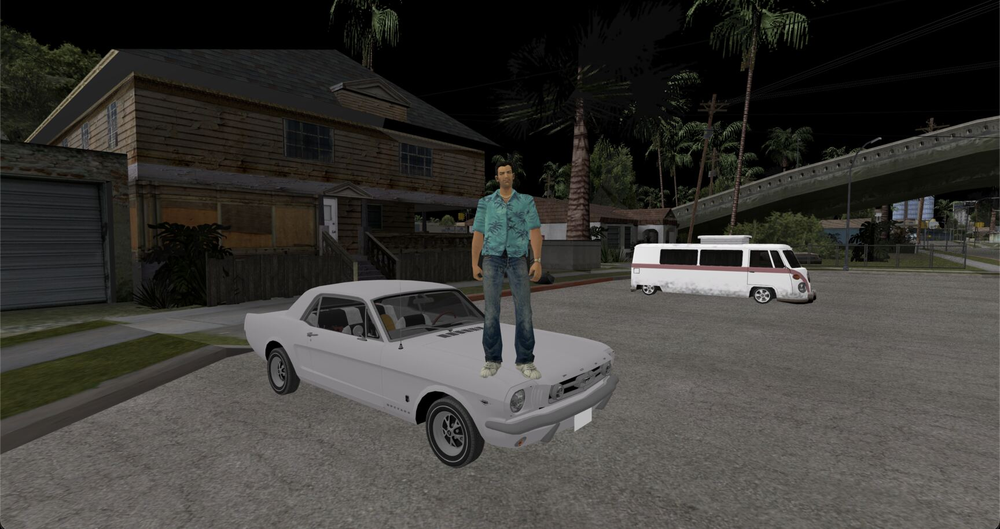

A particularly interesting bit is implementing entering a car. Seems like a simple task: here's the car, here's the animation of the character opening the door and getting in. What could be simpler?!

But of course it's not that simple!

1. We need to figure out which car is closest to the player. We build a registry of nearby cars — cast rays, find them, measure distance…
2. We find the door where the steering-wheel dummy (the driver's seat) is located.
3. We build a path using the car's collision so we don't walk through it.
4. The car's collision isn't enough — we have to account for the player's collision + add a gap, otherwise the player can get stuck for good and never arrive.
5. While getting in, there was a very weird bug — the car would fly off and the character would tumble out. The cause? It turned out the player's collision affects the car: Tommy was, in effect, kicking the car while getting in. I had to use a trick — during entry and driving I disable Tommy's collision entirely. This risks edge-case problems later: once traffic exists, if another car slams into Tommy while he's getting in, it'll pass right through him. We'll solve it later.

I also implemented a gameplay damage system.

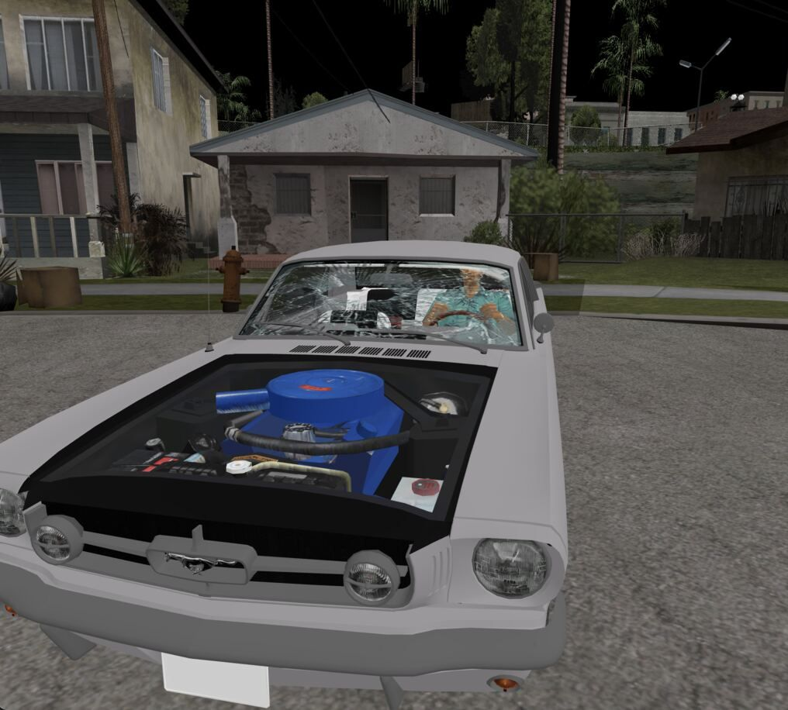

## Physics

The most important thing in physics for this type of game is paying special attention to the main protagonists: cars and characters. That's what I focused on first.

I'd never built physics engines for games and honestly didn't understand it well, but the goal of this project was to reproduce realistic behavior. And here's how it goes:

The game has a handling.cfg file — a complete description of a car: its mass, speed, and other characteristics. At first I tried to force a square peg into a round hole: I parsed this data and just manually applied it to each car, tried to simulate collisions, and so on. After a while I realized I was doing something completely pointless. Once I looked into it, I found that the wonderful Rapier physics engine is fully built for this out of the box:

[Rapier](https://rapier.rs/javascript3d/classes/DynamicRayCastVehicleController.html)

Literally 5 minutes — and the cars started driving around the map.

There were bugs, of course, where would we be without them. **Video**:

But those are trifles. Things got rolling.

For the character I used a kinematic controller with inertia: on a sharp change of direction the character doesn't react instantly — there's a slight acceleration and deceleration, which feels closer to the later games in the series. Not perfect yet, but a good start.

## Rendering

The game implements the standard approach of the GTA series:

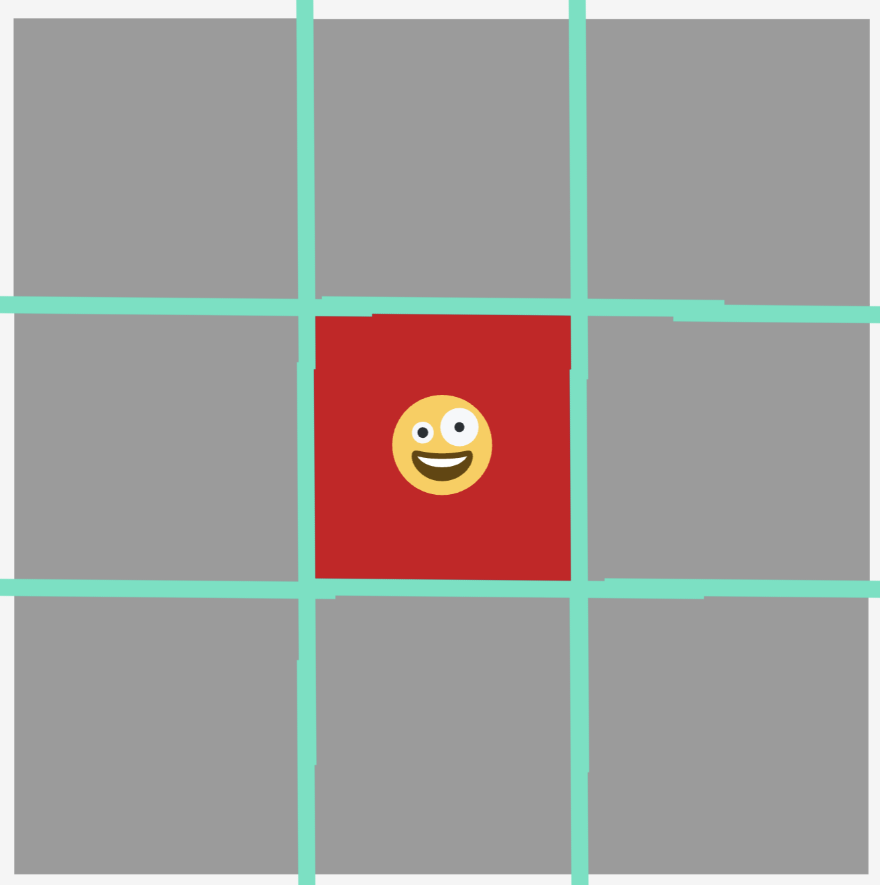

The world is divided into squares. The player is in the central one. Low-poly models are rendered around them. As you move, they swap to high-poly ones. Also, objects like trees, road signs, and so on appear as you move — a streaming system; they have no LOD (low-poly) model.

We hide the draw distance with fog — it looks nicer and keeps you from seeing holes in the map.

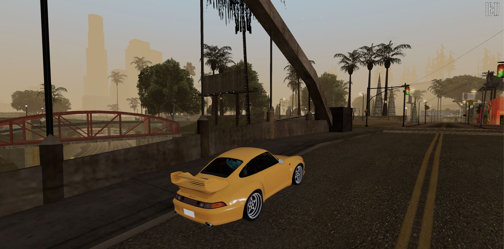

Of course, both the grid size and the draw distance for every object type are adjustable.

## Time and Weather

Before implementing the graphics, I did time. Time runs not in sync with real clocks but with a multiplier — one minute = 3 real seconds (also adjustable in the config).

I also implemented a weather manager with procedurally generated "cheap" clouds. Full support for the game's internal timecyc system.

**Video**:

## Graphics

Alright, time to talk about graphics. In old games like GTA San Andreas, graphics are a compromise. Back then, with those computers, dynamic lighting or real shadows were simply impossible.

In the original GTA models, shadows and light are baked into the geometry. This system is called prelit and night vertex colors. That way we get pre-computed shadows, sun highlights, and a pleasant atmosphere that doesn't react to light sources at all — because there are almost none.

Since I'm developing from scratch, I can run any experiments I want. The first thing I tried was real sun and shadows.

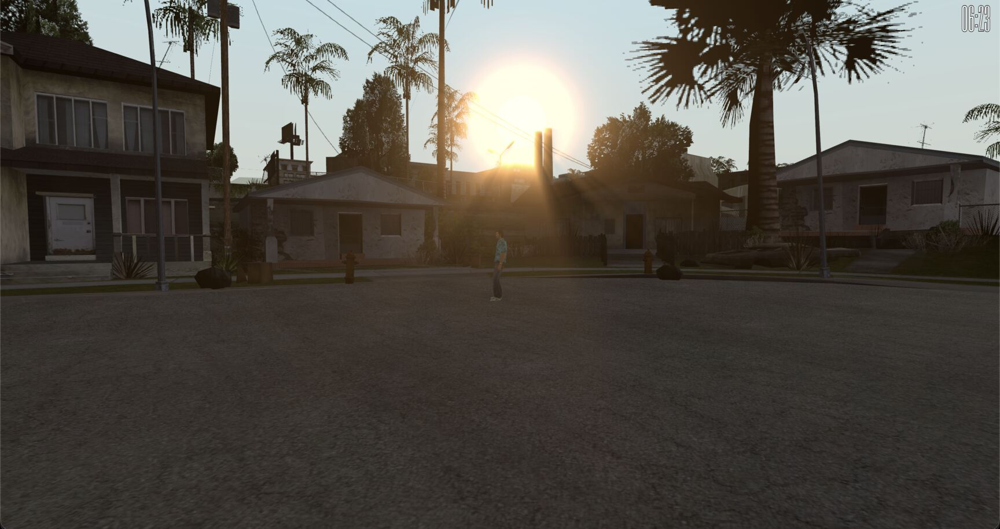

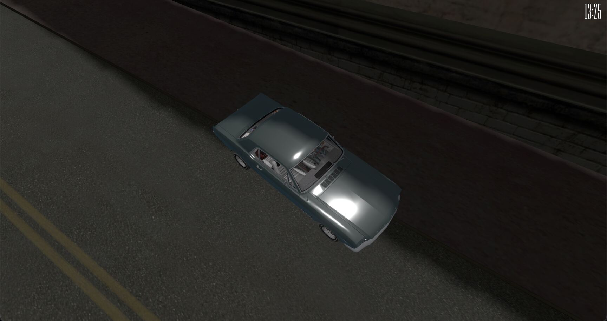

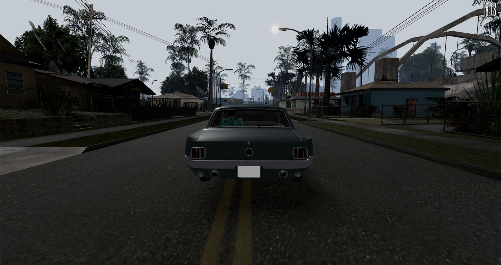

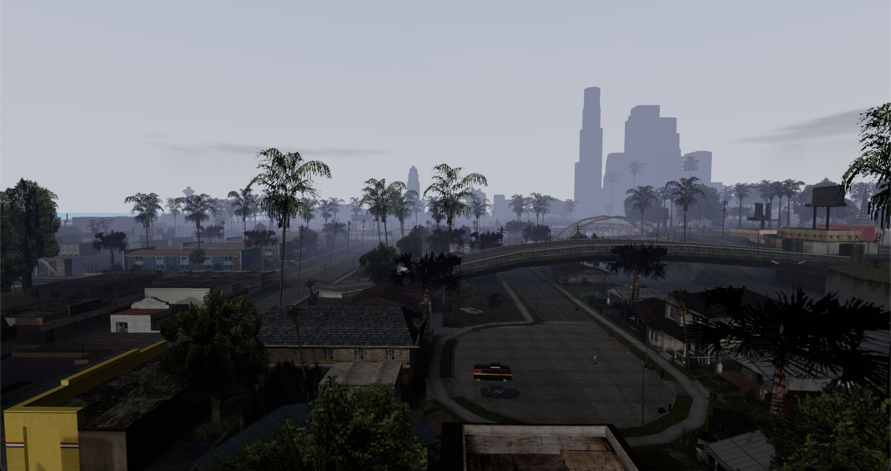

Overall it looked decent, but it required major reworks and the image lost its authenticity. The game started looking more like GTA 4 than San Andreas.

So I shelved that work for now and built the original-style graphics, but with some cool effects added, like Sun, God Rays, Bloom, tonemapping.

The result is a very warm and rich image — both by day and by night, in the spirit of the original.

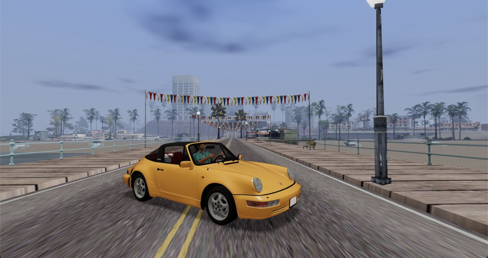

I'll still be working on this a lot, so the result is intermediate for now — what it'll look like in the end is unclear.

## Mod Support

One of the strongest parts of the project is that I try to reproduce not only the model and texture spec, but also the file system, the coordinate system, and so on. So I get full mod support out of the box.

I ran a test on two major mods.

GTA Carcer City (2026):

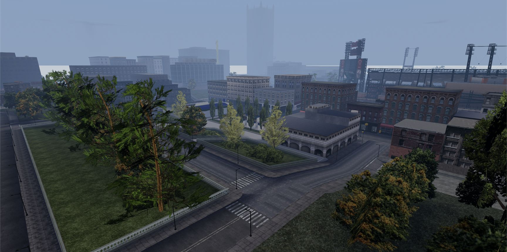

GTA Anderius (2009):

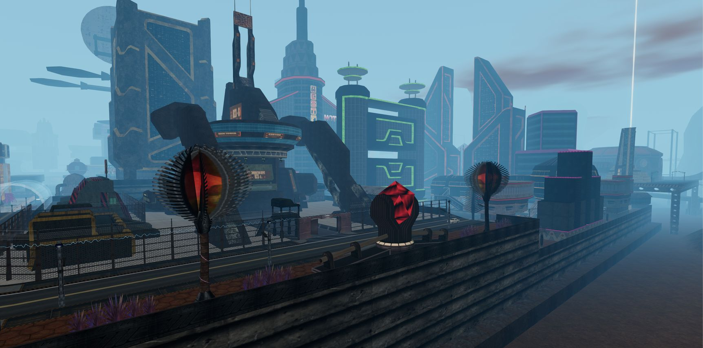

The whole map works fine, all objects are in place.

## Optimization

Optimization work is a topic of its own. Since this game is not only heavy to render on the client but also downloads a large amount of models and textures, optimization had to be approached comprehensively:

First, we don't load all of the game's files, only what's needed for the tech demo — the map, a couple of custom cars, and Tommy.

Second, all assets are split into small chunks, packed into ZIP, so they can be pulled from a CDN quickly and in parallel.

The project's architecture changed, and two separate entities appeared:

**Preloader** — a component that downloads assets according to priority. It can re-download failed parts, cache, and read from cache. The current version is used for invalidation.

**Virtual File System.** In the initial version the demo worked directly with the img archive, which was about 1 gigabyte, but the VFS made it possible to work with ZIP chunks. Once the preloader has downloaded them, it hands the data to the VFS, and the game works against the VFS interface. This way, the game knows nothing about how our assets are packed. For convenient local development you can work with the game's archives directly, and at deploy time pack only what's needed into chunks and read from them:

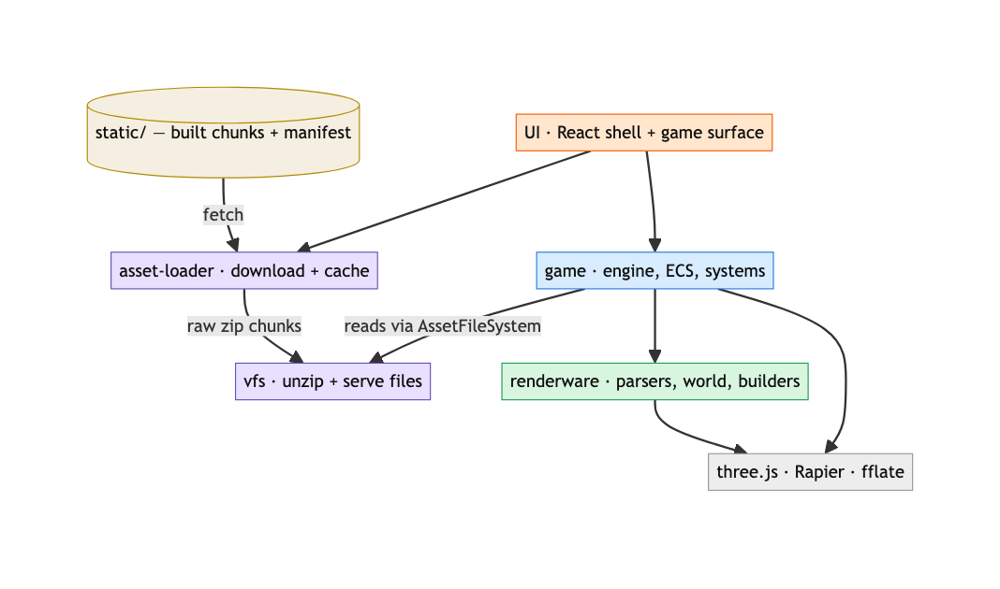

## Working with Claude Code

This project is 85% built with Claude Code — a great experiment showing how much development has changed. The active phase of the entire development process was done in spare time, over just 3 weeks. By one person. But you can't achieve results like that without following a set of rules:

Before starting work, I set up a very aggressive linting system that cut out all the noise and clutter of development.

I had a firm grasp of the engine's algorithm, a firm grasp of how to build the roadmap and how to prioritize tasks. Without that understanding, a request like "make me a GTA clone" obviously won't work.

Every task was accompanied by planning. All ideas, work-in-progress, and changes were strictly documented. Changes were reviewed. If context was lost, I knew exactly where that knowledge lived. I had to watch this very actively, because Claude Code tried with all its might to avoid documentation, even after it was added to memory.

Tests, tests, and more tests. From the start I established a rule — use real data for tests: if we test a DFF model, we work at the level of the actual file, not an emulation. As a separate iteration, after the core features were done, I fully covered the missing areas with tests, built an e2e platform for testing, and verified all the documentation.

Bugs, ideas, leftovers — all of it is documented too, tagged, for the future. Development guides were written right away.

In short, if you have a full understanding of the task, technical competence, and you watch the results — you can work miracles.

## Conclusion and What's Next

Honestly, this is far from a complete account of all the problems, subtleties, and nuances of the development. At almost every step there was something new, something I hadn't explored before.

The point of all this is that this project is a vivid example of how modern tools like Claude Code Opus, combined with a solid understanding of the domain and of programming in general, make it possible to do — solo, in three weeks — what used to take teams of hundreds or even thousands of people.

I want to keep developing the project and bring it to a stable state. If anyone can help with contributing — I'd be very glad.

That's all from me. Thanks everyone for your attention!

Links once more:

- [Demo](https://opensa.cc)
- [Repo](https://github.com/AlexSergey/opensa)
