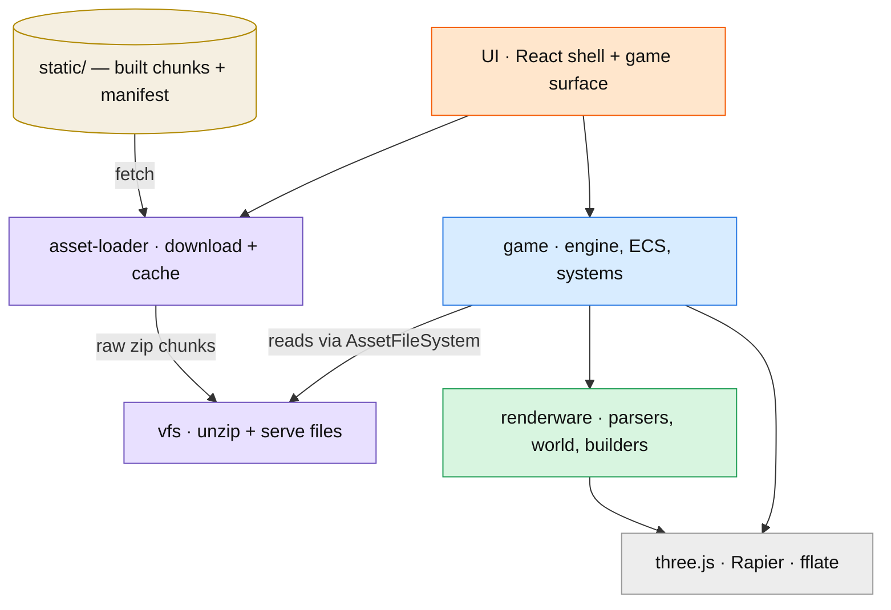
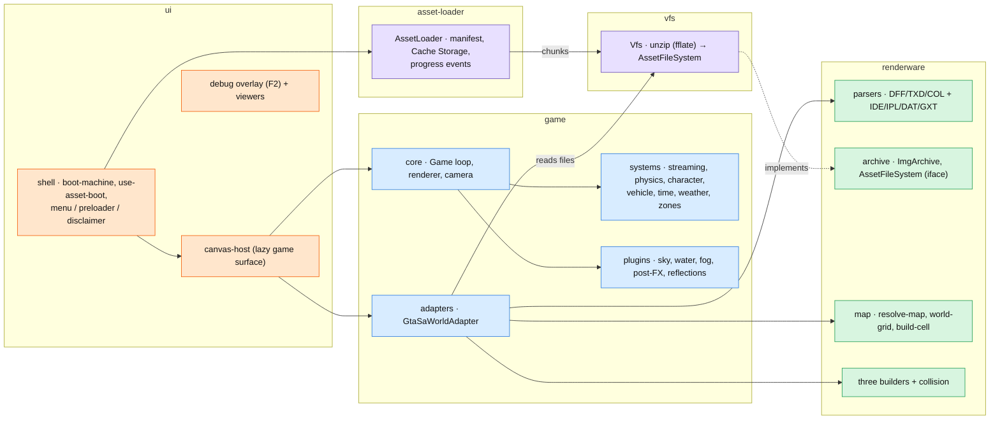
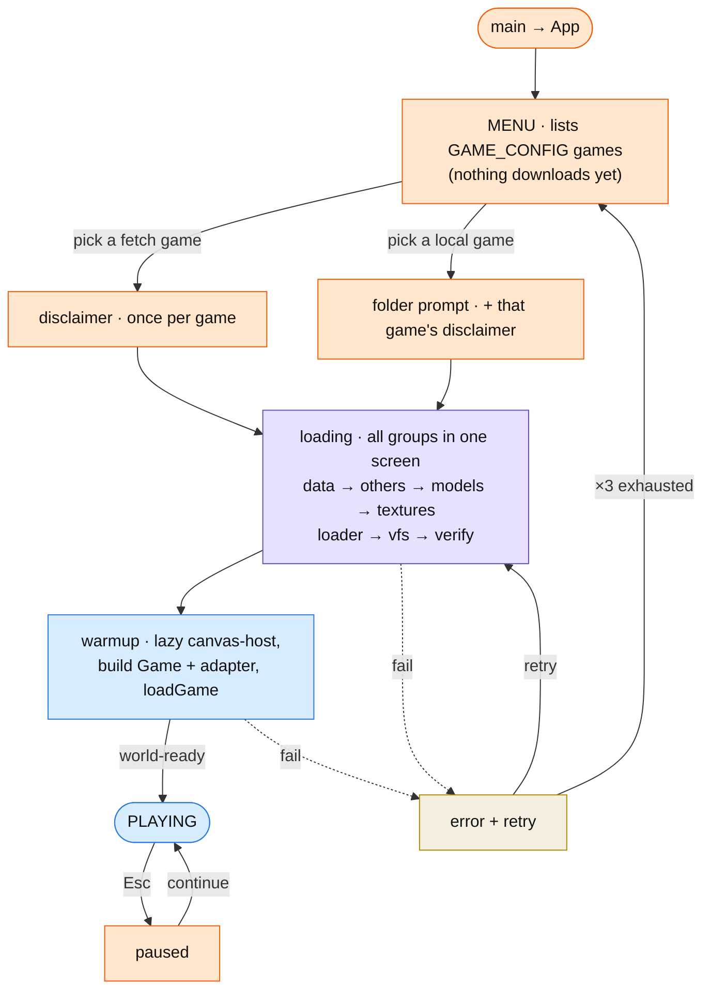
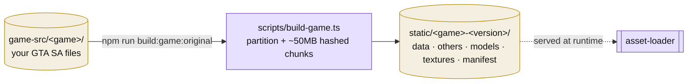

# Architecture

A high-level map of OpenSA. Two levels: the **modules** and how they depend on each other, then a
**detailed** look inside them, plus the **boot** and **build** flows. Details are intentionally trimmed for
readability — see [docs/features/](./features/) and [docs/plans/](./plans/) for specifics.

## Repository layout

OpenSA is an **Nx + npm-workspaces monorepo** (see [plan 057](./plans/057-nx-monorepo-migration.md)). The modules
below map one-to-one to workspace packages; every package keeps only `package.json` (+ `readme`/`docs`) at its
root and **all code lives in `<pkg>/src/`**. Cross-package imports go through the `@opensa/*` package name
(subpath `exports` → `.ts`, no build step), never deep relative paths.

```
apps/
  web/      @opensa/web      React shell + game surface + game-config + controls-harness  (tag type:app)
  viewer/   @opensa/viewer   standalone object/vehicle/character viewers — tabs in /viewer.html  (type:app)
packages/                    (tag type:engine)
  renderware/  @opensa/renderware   parsers (DFF/TXD/COL, IDE/IPL/DAT/GXT) + archive + map + three builders
  game/        @opensa/game         engine, ECS, systems, plugins, adapters
  loaders/     @opensa/loaders      asset-loader (fetch/local) — framework-agnostic
  vfs/         @opensa/vfs          unzip → AssetFileSystem
  game-build/  @opensa/game-build   partitioning shared by the loaders + build scripts
tools/                       (tag type:tool — offline; read the engine, never the app)
  rw-codec/ · tool-kit/ · map-optimizer/ · opensa-lod-generator/ · vehicle-optimizer/ · timecyc-builder/
root: game-src/ · static/ · tests/ · e2e/ · scripts/ · deploy/ · nx.json · *.html · configs
```

**Module boundaries** are enforced in lint by `@nx/enforce-module-boundaries` via `package.json` `nx.tags`:
`type:app` → app + engine; `type:engine` → engine only (never app/tools); `type:tool` → engine + tools. This
replaces the old hand-rolled `gameBoundaryConfig` (the `game → renderware` rule still lives in `eslint.config.ts`).

## Level 1 — modules



**Rules of the road**

- **`AssetFileSystem`** (defined in `renderware/archive`) is the seam: the game reads files through it and
  doesn't care that the **vfs** provides them today.
- Only **`game/adapters`** (and `game/mods`) may import **renderware** — it's the leaf layer.
- **asset-loader** and **vfs** are standalone (no React, no game).
- three.js / Rapier load **lazily** with the game surface, so the UI shell paints instantly.

## Level 2 — inside the modules



## Boot flow

The menu is the first screen — **nothing downloads until a game is picked** (no eager pre-menu load). Each
game in `GAME_CONFIG` carries its own loader: a **fetch** game (e.g. Gostown) downloads chunk archives; a
**local** game (San Andreas) reads a user-picked install. The disclaimer is remembered per game.



A fetch game whose disclaimer was already accepted skips straight to **loading**. Cache-Storage chunks are
re-used across visits (keyed by build version); a revoked build — a missing `data` probe or `manifest.json`
— wipes the cache. See [features/ui-shell.md](./features/ui-shell.md) and
[features/asset-loader.md](./features/asset-loader.md).

## Build pipeline (offline)



> Runtime in one line: **static chunks → asset-loader (cache) → vfs (unzip) → AssetFileSystem → game ←
> renderware → three.js + Rapier**, all behind an instant React shell.
