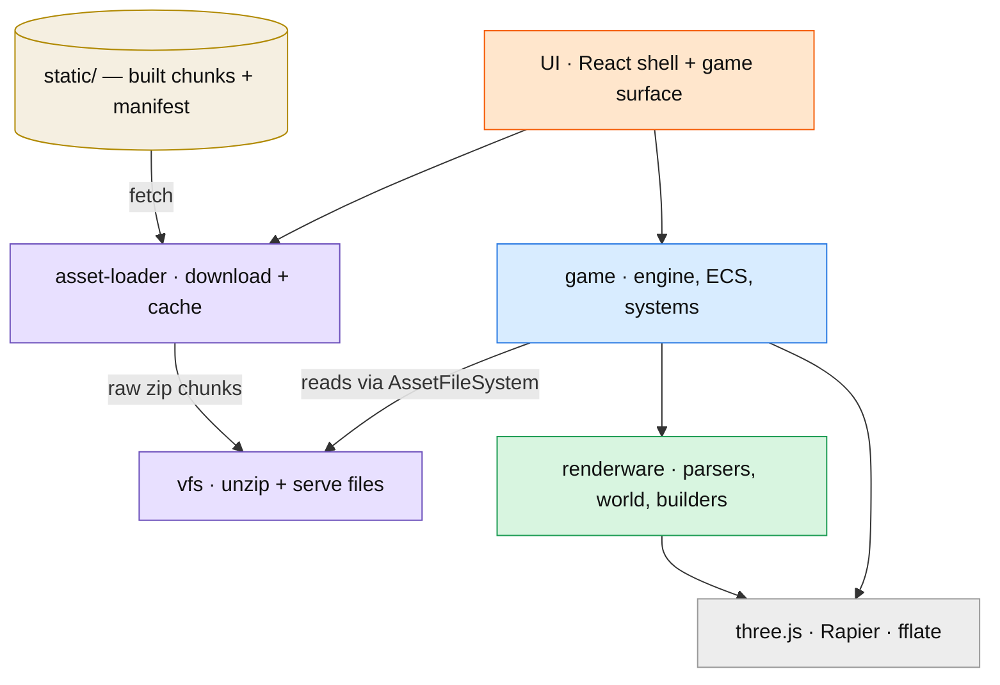
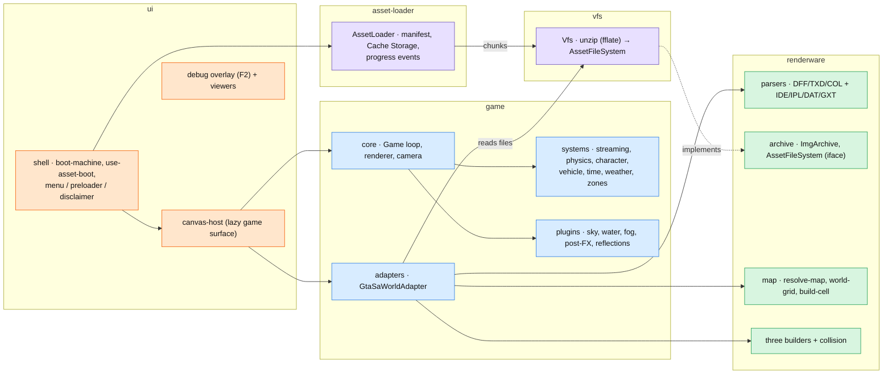
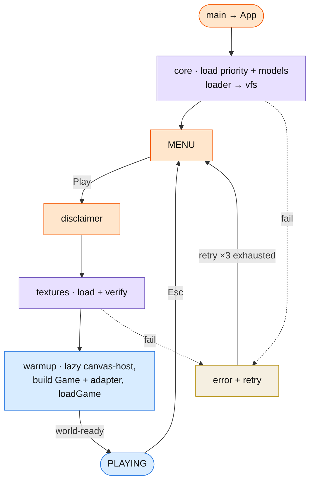
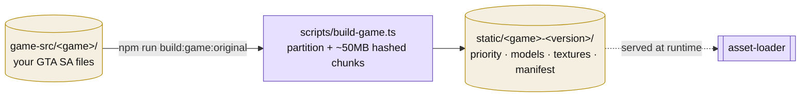

# Architecture

A high-level map of OpenSA. Two levels: the **modules** and how they depend on each other, then a
**detailed** look inside them, plus the **boot** and **build** flows. Details are intentionally trimmed for
readability — see [docs/features/](./features/) and [docs/plans/](./plans/) for specifics.

## Level 1 — modules

**Rules of the road**

- **`AssetFileSystem`** (defined in `renderware/archive`) is the seam: the game reads files through it and
  doesn't care that the **vfs** provides them today.
- Only **`game/adapters`** (and `game/mods`) may import **renderware** — it's the leaf layer.
- **asset-loader** and **vfs** are standalone (no React, no game).
- three.js / Rapier load **lazily** with the game surface, so the UI shell paints instantly.

## Level 2 — inside the modules

## Boot flow (first visit)

Return visits skip the intro animation (a localStorage flag) and re-use the Cache-Storage chunks.

## Build pipeline (offline)

> Runtime in one line: **static chunks → asset-loader (cache) → vfs (unzip) → AssetFileSystem → game ←
> renderware → three.js + Rapier**, all behind an instant React shell.
